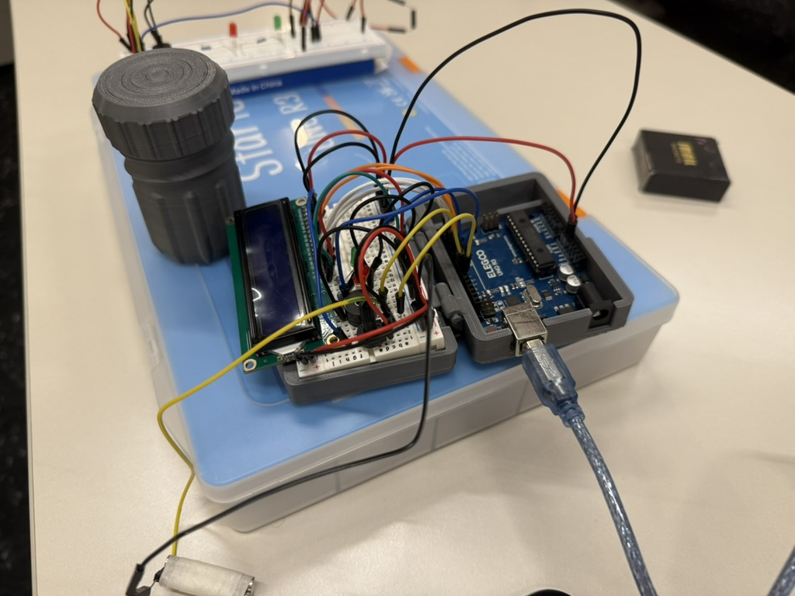

# SafeSnap
### Smart Medication Safety Device
**3rd Place – Georgia Tech MedTech Hackathon 2026**

SafeSnap is an embedded system designed to reduce accidental double dosing by monitoring when a medication bottle is opened. The system passively detects cap removal using a magnetic reed switch and alerts users if a second dose is attempted before the configured medication interval has elapsed.

---

## Features

- Passive magnetic cap detection using a reed switch and neodymium magnet
- Configurable medication dosing intervals
- Real-time status updates displayed on a 16×2 LCD
- Audible and visual alerts using a buzzer and LED
- Debounce handling for reliable cap-open and cap-close detection
- Embedded firmware written in Arduino C++

---

## Hardware

- Arduino Uno
- Reed Switch
- Neodymium Magnet
- 16×2 LCD Display
- Piezo Buzzer
- LED
- Breadboard and supporting circuitry

---

## Software

The embedded firmware continuously monitors the reed switch to detect medication bottle openings and closings.

Core functionality includes:

- Event detection
- Debounce logic
- Dose interval timing
- LCD status updates
- LED/Buzzer alerts
- State management for medication events

---

## How It Works

1. The reed switch detects when the medication bottle is opened.
2. The system records the time of the event.
3. If the bottle is reopened before the prescribed interval has elapsed, the device triggers visual and audible alerts.
4. Once the medication interval expires, the bottle can be opened again without triggering an alert.

---

## Results

- 🥉 3rd Place at the Georgia Tech MedTech Hackathon
- Successfully completed 30+ prototype test cycles
- Reliable cap state detection with consistent alert generation

---

## Tech Stack

- Arduino
- C++
- Embedded Systems
- Microcontrollers

---

## Future Improvements

- Bluetooth connectivity for caregiver notifications
- Mobile companion application
- Rechargeable battery system
- Adjustable dosing schedules through a user interface
- Medication history logging

---
## 📸 Gallery

🎥 **Demo Video**  
See SafeSnap in action, including cap detection, LCD feedback, and alert behavior.

➡️ **[Watch the Demo](https://www.youtube.com/watch?v=xqwiIpY-nhI)**

---

📑 **Project Presentation**  
Overview of the design process, hardware architecture, implementation, and testing.

➡️ **[View Presentation (PDF)](safesnap.pdf)**

---

### Prototype

  

*Final SafeSnap prototype.*

---

## Team

Developed as part of the Georgia Tech MedTech Hackathon (2026).
